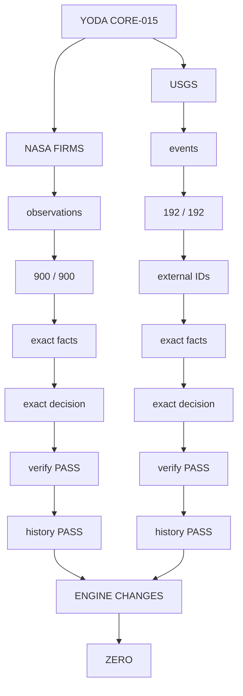

# Yoda v0.1

Yoda is a local, verifiable decision-state layer for autonomous software.

## Vision

> The internet is a living organism. Data is born, changes, forms relationships, conflicts, ages, and is replaced. Yoda does not try to own the internet. It records the verifiable DNA of the data it observes: origin, identity, relationships, history, mutations, and the evidence produced by experiments.

Yoda grows through propagation: real problems become reproducible evidence, reproducible evidence becomes reusable experiments, and reusable experiments generate new knowledge.

See `PROPAGATION-MODEL.md` for the product and community growth model behind this idea.

## Try the Preview

Download these two files from the current GitHub prerelease:

    yoda-v0.1.0-preview.1-linux-x86_64.tar.gz
    yoda-v0.1.0-preview.1-linux-x86_64.tar.gz.sha256

Verify the downloaded archive:

    sha256sum -c yoda-v0.1.0-preview.1-linux-x86_64.tar.gz.sha256

Extract it:

    tar -xzf yoda-v0.1.0-preview.1-linux-x86_64.tar.gz
    cd yoda-v0.1.0-preview.1-linux-x86_64

Run Yoda:

    ./yoda init ./memory

No server, account, network connection, Python, Node, or JVM is required.

Release:

    https://github.com/josefaquino/Yoda/releases/tag/v0.1.0-preview.1

## Platform

Current validated binary:

- GNU/Linux
- x86_64
- dynamically linked against glibc

Source:

- ISO C11
- POSIX.1-2008

## Quick Start

Create a database:

    ./yoda init ./memory

Store evidence:

    printf '%s\n' 'PostgreSQL 16 approved for production' |
        ./yoda -d ./memory put evidence/db-validation \
            source=production-validation

Retrieve exact evidence:

    ./yoda -d ./memory get evidence/db-validation

Find evidence:

    ./yoda -d ./memory find production

Build bounded context:

    ./yoda -d ./memory context production

Verify authoritative state:

    ./yoda -d ./memory verify

## Commands

    init
    put
    get
    find
    link
    log
    verify
    context

## Build From Source

    make

Compiler requirements:

    ISO C11
    POSIX.1-2008

The validated build uses:

    -std=c11
    -O2
    -Wall
    -Wextra
    -Werror
    -D_POSIX_C_SOURCE=200809L

## Authority

`data.yoda` is authoritative.

Derived indexes are rebuildable and must not become the source of truth.

See `PRODUCT-CONTRACT.md` for the complete Yoda v0.1 product contract.

---

## External Validation Case

A small decision-state example is included:

    cd examples/decision-state
    ./run.sh

The example demonstrates:

- historical evidence;
- newer evidence;
- an explicit `supersedes` relation;
- lexical retrieval;
- bounded context retrieval;
- authoritative-state verification.

No network connection, model API, Python runtime, server, or account is required.

After testing, see:

    CASE-EXTERNAL-001.md
    FEEDBACK.md

---
## Cross-Domain Validation — Core-015

Yoda is being validated incrementally against distinct real-world public datasets.

The objective is not to optimize the engine for a single domain. Each experiment applies the same frozen core to a different type of data and asks a narrow, reproducible question.

The current evidence shows that **Yoda Core-015 has passed two independent public-data validation cases without requiring an engine change**.

### Validation Cases

| Case | Public authority | Domain | Records | Identity model | Fact equivalence | Decision equivalence | Verify | History | Engine changes |
|---|---|---|---:|---|---|---|---|---|---:|
| `FIRMS-001` | NASA FIRMS | Satellite observations | 900 | Content-derived SHA-256 | PASS | PASS | PASS | PASS | 0 |
| `USGS-001` | USGS Earthquake Catalog | Seismic events | 192 | External USGS event ID | PASS | PASS | PASS | PASS | 0 |

### FIRMS-001 — Public Observation Equivalence

FIRMS-001 tested Yoda against a public NASA FIRMS VIIRS observation dataset.

The source contained 74,605 observations. A deterministic geographic subset reproduced the NASA reference result of:

    900 observations
    324 2.0URT observations
    576 other observations

All 900 observations were persisted into Yoda Core-015 and replayed through the public database interface.

Result:

    OBSERVATIONS_INGESTED=900
    OBSERVATIONS_REPLAYED=900

    RECORDS_VERIFIED=900

    FACT_EQUIVALENCE=PASS
    DECISION_EQUIVALENCE=PASS
    DURABLE_HISTORY=PASS
    EVIDENCE_INTEGRITY=PASS

No LLM, Python, or SQL was used in the tested path.

See:

    cases/FIRMS-001-public-observation-equivalence/

### USGS-001 — Public Earthquake Event Equivalence

USGS-001 moved the same engine into a different domain: public earthquake events from the USGS Earthquake Catalog.

The experiment used a frozen historical query:

    2025-01-01
    through
    2025-01-08

    minimum magnitude = 4.5

The independent USGS count endpoint and the downloaded catalog both reported:

    192 events

Unlike FIRMS-001, object identity was not derived from record content. Yoda preserved the external event identity assigned by USGS.

Example:

    usgs/event/nc75111126

The deterministic magnitude classification produced:

    4   M6_PLUS
    188 BELOW_M6

Yoda reproduced the same result after persistence and replay.

Result:

    EVENTS_INGESTED=192
    EVENTS_REPLAYED=192

    RECORDS_VERIFIED=192

    EXTERNAL_IDENTITY_PRESERVED=PASS
    FACT_EQUIVALENCE=PASS
    DECISION_EQUIVALENCE=PASS
    DURABLE_HISTORY=PASS
    EVIDENCE_INTEGRITY=PASS

No LLM, Python, or SQL was used in the tested path.

See:

    cases/USGS-001-public-earthquake-equivalence/

### What These Results Demonstrate

These experiments do not claim that Yoda detects fires, predicts earthquakes, outperforms specialized databases, or provides domain expertise.

They demonstrate a narrower foundation:

> The same frozen Yoda Core-015 can ingest data from distinct public domains, preserve deterministic identities and facts, verify authoritative state, maintain durable history, and reproduce independently computed results exactly.

The two cases exercise different identity models:

    FIRMS
    observation content
          ↓
    SHA-256 identity
          ↓
    firms/obs/<sha256>

and:

    USGS
    external authority
          ↓
    public event ID
          ↓
    usgs/event/<event-id>

Both passed without changes to the storage engine.

### Experimental Principle

Yoda development follows an evidence-driven rule:

> Do not adapt the engine to a dataset before the dataset demonstrates where the engine is insufficient.

A successful experiment does not automatically justify a new feature.

A failed experiment does not automatically justify a new feature.

Structural changes should be earned by limitations that recur across independent real-world cases.

The current state is therefore:

    FIRMS-001 = PASS
    USGS-001  = PASS

    CORE-015 = RETAIN

    ENGINE_CHANGES_EARNED = 0

### Direction

Future cases will deliberately expose the same engine to different workloads and different forms of pressure:

    scientific observations
    event streams
    temporal revisions
    graph relationships
    market data
    high-volume ingestion
    crash recovery
    point-in-time reconstruction

The goal is not to prove one large thesis in a single experiment.

The goal is to accumulate small, reproducible and independently verifiable pieces of evidence until the real properties — and real limitations — of Yoda emerge from practice.

## Field Cases

Yoda grows by propagation: real problems become reproducible evidence, reproducible evidence becomes reusable experiments, and reusable experiments generate new knowledge.

### FIELD-001 — Multi-Agent Decision State

Can independent decision processes recover consistent, decision-relevant evidence from shared durable state without sharing transient conversational context?

    cases/FIELD-001-multi-agent-decision-state/

The case is designed to be reproduced, adapted, forked, and republished.

### COMMAND-NATIVE-001 — Command Contract for Agents

Can an autonomous agent recover decision-relevant durable state through a small Yoda command vocabulary without SQL, raw database access, or a full state dump?

    cases/COMMAND-NATIVE-001-command-contract/

The tested free-form textual command protocol produced a valid negative result for the tested model and task. The failure was at the agent-command transport boundary, not in Yoda storage. The result earned a narrower next experiment: keep the command vocabulary fixed and test typed/native tool transport.

Negative results are evidence too.

### FIRMS-001 — Public Observation Equivalence

Can the same Yoda kernel preserve real public scientific observations and reproduce exactly the facts and deterministic classification derived independently from the original source?

    cases/FIRMS-001-public-observation-equivalence/

Using the public NASA FIRMS VIIRS sample dataset, the validated run ingested and replayed 900 USA (Conterminous) + Hawaii observations. All 900 records passed authoritative verification, and both canonical fact equivalence and deterministic classification equivalence passed exactly. The experiment used no LLM, Python, or SQL in the tested path.

FIRMS-001 does not claim fire detection, prediction, or database performance superiority. It establishes a narrower milestone: a second real-world domain can be represented and replayed by the existing Yoda kernel without a product change.

### BGP-RIPE-RIS-001 — Real Routing-State Mutation Equivalence

Can the KyberDB public embedded API apply a real stream of BGP announcements and withdrawals, persist it with full durability, close and reopen the database, and reconstruct exactly the same routing state as an independent oracle?

    cases/BGP-RIPE-RIS-001-real-routing-state-equivalence/

Using a frozen RIPE NCC RIS `rrc00` historical MRT update file, the validated run processed 50,000 real BGP events: 47,838 announcements and 2,162 withdrawals. The workload produced 19,059 distinct route identities using `peer_ip + peer_asn + prefix`.

After five durable commit batches, database verification, close/reopen, and a second verification, KyberDB reconstructed 18,318 active routes. The independent oracle also produced 18,318 routes, and both final states had the exact same SHA-256:

    edff6d9b57012b610a99c9c03dc9fd008c1632d8602186bc98c930cc1e611890

Result:

    POST_REOPEN_STATE_EQUIVALENCE=PASS
    DATABASE_VERIFY_PRE_CLOSE=PASS
    CLOSE_REOPEN=PASS
    DATABASE_VERIFY_POST_REOPEN=PASS
    EVIDENCE_INTEGRITY=PASS
    ENGINE_CHANGE=NO

This is a KyberDB Public Embedded ABI field case, not a Yoda CORE-015 CLI validation. It establishes exact mutation-state correctness and durability for the tested RIPE RIS workload; it does not claim BGP-system functionality or performance superiority.

### GENOME-KMER-001 — Verifiable Genomic K-mer Index

Can the KyberDB public embedded API transform a real genomic sequence into a local, durable and verifiable k-mer frequency index, then reconstruct exactly the same index after close/reopen?

    cases/GENOME-KMER-001-verifiable-genomic-kmer-index/

Using the public NCBI RefSeq *Escherichia coli* K-12 MG1655 reference (`GCF_000005845.2`, `NC_000913.3`), the validated 100K stage decomposed 100,000 valid 31-base windows into 99,926 unique k-mers and persisted each exact k-mer with its occurrence count.

After 100 durable commits, pre-close verification, close/reopen and post-reopen verification, KyberDB recovered all 99,926 indexed k-mers with zero missing keys and zero value mismatches. The independent oracle and KyberDB post-reopen state produced the same SHA-256:

    b561ab1e0d956d5108c42cf63c8c2220fee2746503027a446161f5044abb1b6a

Result:

    ORACLE_RECORD_COUNT=99926
    KYBER_RECORD_COUNT=99926
    POST_REOPEN_MISSING=0
    POST_REOPEN_VALUE_MISMATCH=0
    POST_REOPEN_STATE_EQUIVALENCE=PASS
    DATABASE_VERIFY_PRE_CLOSE=PASS
    CLOSE_REOPEN=PASS
    DATABASE_VERIFY_POST_REOPEN=PASS
    EVIDENCE_INTEGRITY=PASS
    ENGINE_CHANGE=NO

This case establishes a foundational genomic-storage capability: exact local identity and frequency for k-mers with deterministic reconstruction after persistence. It does not claim variant calling, sequence alignment, genome assembly, pangenome analysis or biological interpretation.

This is a KyberDB Public Embedded ABI field case, not a Yoda CORE-015 CLI validation.

See `PROPAGATION-MODEL.md` for the propagation model.

---

## License

Yoda v0.1.0-preview.1 is distributed under the Apache License, Version 2.0.

See:

    LICENSE